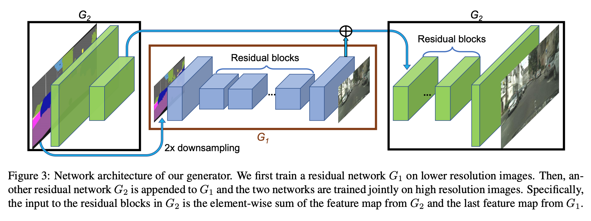

# High-Resolution Image Synthesis and Semantic Manipulation with Conditional GANs

# Info

- Data : 11/30/2017
- Authors : Ting-Chun Wang, Ming-Yu Liu, et al.
- Journal reference : CVPR 2018

# どんなもの？

新たなadversalial loss とmulti-scale generator, discriminator architectures を用いて semantic label map から高解像度（2048x1024）の画像を生成する手法を提案した．

さらに提案フレームワークを拡張させ，２つの機能を用いてinteractive な視覚的操作を可能にした．

1. object segmentation instance 情報を統合し，オブジェクト操作を可能にさせた．
2. ある１つの入力に対して多様な出力を生成させる手法を提案し，ユーザーがインタラクティブに物体の外観を変更することを可能にした．

# 先行研究と比べてどこがすごい？

主に比較対象とする先行研究は先行研究1: [Q. Chen](https://arxiv.org/abs/1707.09405) のperceptual loss を改良した手法．

その先行研究で，adversarial training はunstable であり，高解像度の画像生成タスクにおいて学習が失敗しやすいということが分かった．代わりに彼らはsynthesize images について改良した perceoutual loss を用いた．これは高解像度（2048x1024）の画像を生成することができるが，しばしば物体の詳細やrealistic なtextures は欠落する．

本論文では上のSoTA の手法の主な問題点である以下の２つについて取り組んだ．

1. GANs を用いた高解像度の画像生成
2. 先行研究での生成された高解像度画像での，物体の詳細とrealistic texture の欠落

新たなロス関数とcoarse-to-fine なGenerator，multiscale Diiscriminatorを用いることで，先行研究と比べよりrealistic な高解像度（2048x1024）の画像生成を実現した．さらに，生成画像内の物体レベルでの操作を可能にし，ユーザーが最小の努力で素早く新たなシーンの画像を作ることを可能にした．

# 技術や手法のキモはどこ？

pix2pix を直接用いて高解像度の画像を生成させようとしたが，既存のpix2pix学習の不安定さと満足いかない質の画像を生成することが分かった．

そこで本論文ではpix2pix をcoarse-to-fine generator とmulti-scale discriminator，robust adversarial learning objective function を用いてpix2pix を改良した．

## pix2pix について

pix2pix はgeneratorにU-Net 構造を，disciriminator にPathGAN を採用した．しかし，pix2pix の実験では最大でも256x256 の解像度であった．そこで，試しにpix2pix のモデルのままで高解像度の画像生成を実験してみたところ，学習の不安定さと生成画像の質の悪さが分かった．

## Improving pix2pix for Photrealism and Resolution

本論文ではpix2pix をcoarse-to-fine generator と multi-scale discriminator ，そして robust adversarial lerning objective function を用いて改良した．

### Coarse-to-fine generator

まず，generator $G$ を２つのサブネットワーク: $G_1$ (global generator network), $G_2$ (local enhancer network)に分ける．generator は Fig. 3 のように１組みで与えられる $G = \{ G_1, G_2\}$．

</img>

$G_1$ $G_2$ の入力画像が2048x1024 のときは1/2 にdownsampling した1024x512 の画像を入力し1024x512 の画像を出力する．そして，$G_2$ の出力画像は$G_1$ の出力画像の縦横を2倍にした2048x1024 の画像を出力する．より高解像度の画像を作る際は 追加の local enhancer network を用いる．具体例は以下参照．
>   For example, the output image resolution of the generator $G = \{G_1, G_2\}$ is 2048 × 1024, and the output image resolution of $G = \{G_1, G_2, G_3\}$ is 4096 × 2048.

$G_1 G_2,$ は先行研究2 （この論文では最大で512x512 の解像度でneural style transfer が可能であることを示した）を基に作られている．詳細は以下参照.

>   ​    Our global generator is built on the architecture proposed by Johnson et al. [22], which has been proven successful for neural style transfer on images up to 512 × 512. It consists of 3 components: a convolutional front-end $G^{ (F )}_1$, a set of residual blocks $G^{(R)}_1$ [18], and a transposed convolutional back-end $G^{(B)}_1$. A semantic label map of resolution1024×512 is passed through the 3 components sequentially to output an image of resolution 1024 × 512.
>   ​    The local enhancer network also consists of 3 components: a convolutional front-end $G^{(F)}_2$, a set of residual blocks $G^{(R)}_2$, and a transposed convolutional back-end $G^{(B)}_2$. The resolution of the input label map to $G2$ is 2048 × 1024. Different from the global generator network, the input to the residual block $G^{(R)}_2$ is the element-wise sum of two feature maps: the output feature map of $G^{(F )}_2$, and the last feature map of the back-end of the global generator network $G^{(B)}_1$. This helps integrating the global information from $G1$ to $G2$.

#### 学習方法

まずはじめに1024x512で $G_1$ を学習し，その後$G_1$ に  $G_2$ をくっつけ，$G_1$ の重みを固定した上で2048x1024で $G_2$ のみを学習させる ．最後に，全体 $G_1, G_2$ でfine-tune する？
参考：https://www.slideshare.net/ssuser86aec4/cvpr2018-pix2pixhd-cv-103835371

### Multiscale Discriminator

高解像度な本物画像と生成画像を区別するためには，より大きなreceptive field を持つDiscriminatorが必要となる．これは，deeper network または larger convolutional kernelsのどちらかを要す．しかし，２つともnetwork のcapacity を高め，過学習を引き起こす可能性がある．またより大きなメモリーが必要となるが，高解像度の画像生成を行うGenerator のためにすでに使われている．

このため本論文では３つの全く同じ構造を持つDiscriminator $D_1, D_2, D_3$を扱う．３つとも構造は同じだが，扱う画像サイズが異なる．具体的には画像を 2 downsampling したものと 4 downsampling したものを作り，3 scale（2048x1024 が生成したい画像だとすると，2048x1024, 1024x512, 512x256の３つ）のimage pyramid を作る．そして，$D_1, D_2, D_3$ はそれぞれ，異なるscale の画像で本物と偽物を区別するように学習する．

Multiscale Discriminator 無しでは多くの repeated pattern が生成画像に現れることが分かった．

#### Loss

Multiscale Discriminator の場合，Loss 関数は以下のようになる．

$$
\begin{align}
\min_{G} &\max_{D_1, D_2, D_3} \sum_{k=1}^{3} \mathcal{L}_{GAN} (G, D_k) \\
\text{ここで, }& \notag\\
\mathcal{L}_{GAN}(G, D) &= \mathbb{E}_{s, x} [\log D(s, x)] + \mathbb{E}_{s} [\log(1-D(s, G(s))]
\end{align}
$$
ここでデータセットは$\{(s_i, x_i)\}$ で与えられているとし，$s_i$ はsemantic label であり，$x_i$ は $s_i$ に対応する画像とした．

## Improving adversarial loss

# どうやって有効だと検証した？

# 議論はある?

# 次に読むべき論文は?

## 先行研究

1. Q. Chen and V. Koltun. Photographic image synthesis with cascaded refinement networks.
   In IEEE International Conference on Computer Vision (ICCV), 2017.
1. Johnson, J., Alahi, A., and Li, F. (2016). Perceptual losses for real-time style transfer and superresolution.
   CoRR, abs/1603.08155.