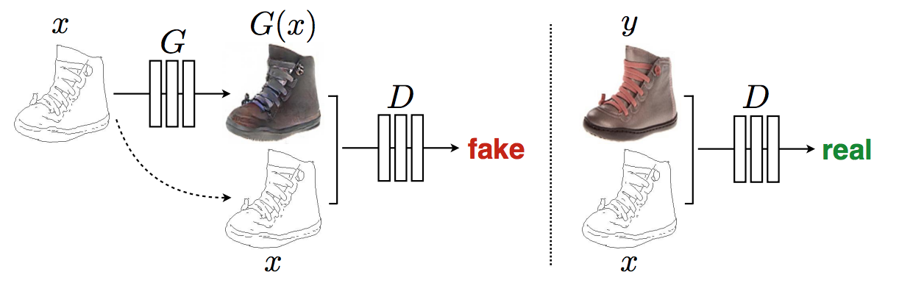

# Image-to-Image Translation with Conditional Adversarial Networks

# Info

- Data : 11/ 2017
- Authors : PHILLIP ISOLA,  JUN-YAN ZHU, et al.
- Journal reference: CVPR 2017

# どんなもの？

あらゆるimage から image へ変換する問題を，同一のアーキテクチャ，ロス関数で解決する手法を提案．

# 先行研究と比べてどこがすごい？

image から image へ変換する問題設定（エッジマップからの色付け，label map からの写真への変換など）は全て共通していたが，今までの手法はこれらの変換を個別の問題として考えていた．本論文ではimage から image へと変換する問題をimage-to-image translationとして定義し，どんな種類の画像変換タスクにおいても同じアーキテクチャ，アルゴリズムで対応可能な手法を提案した．

# 技術の手法のキモはどこ？

- GeneratorにはU-Net を Discriminator には PatchGAN というアーキテクチャを使用した．
  詳細はウェブの別資料に記載したと言っているがどこ？ -> おそらく付録に書いてある．

## Objective

- 先行研究の事実

  - GANの目的関数と，L2やL1 などの昔から知られていたLoss を組み合わせるのは効果的
  - cGANs では入力 $x$ に対する出力 $y$ に多様性を持たせるために Gaussian noize $z$ を入力 $x$ に加えていたが，今回の初期実験では Generator は単に noize を無視して決定的な出力を学んでしまっていた．

- 今回の実験の工夫

  - GANのロスは以下のようにした．L1の方がL2よりも画像のボヤけに強いため L1を用いている．
  $$
  \begin{align}
  Loss &= \mathcal{L}_{cGAN}(G, D) + \lambda \mathcal{L}_{L1}(G) \\
  \text{ここで，}&\\
  \mathcal{L}_{cGAN}(G, D) &= \mathbb{E}_{x, y} [\log D(x, y)] + \mathbb{E}_{x, z} [\log(1-D(x, G(x, z))]\\
  \mathcal{L}_{L1}(G) &= \mathbb{E}_{x, y, z} [\| y - G(x, z) \|_1]
  \end{align}
  $$
  - noize を入れる代わりに  Generatorのいくつかの層に 学習・推論ともに Dropout を適用した．

## Model Architecture

### Generator
__仮説__
img2imgの問題では入力と出力では多くの低レベルな情報が共有される．例えば colorization では入力と出力では特徴的なエッジの位置を共有する．

__工夫__
このことを考慮して論文ではU-Net 構造に skip connection を各層 $i$ と $n-i$ の間につけた．skip connection は単に $i$ 層の出力と $n-i$ 層の入力とを全channel 毎に concatenate するものである．

### Discriminator

__仮説__
以下のFig 4. の様に L1 や L2 ロスでもある程度の（低レベルな部分を捉えた）画像ができる．そこで GAN のDiscriminator には高レベルな特徴を捉えるため，局所的な画像にのみ注意を向ければ良い．

__工夫__
論文ではPatchGAN と呼ばれる方法を提案．この手法はDiscriminator に画像内の NxN のpatch について本物かどうかを判定させる．そして，このDiscmriminator を畳み込み的に画像全体に適用し，各 patchに対する出力を平均化したものを，最終的なDiscriminatorの出力とする．

__検証結果__
$N$ は画像の大きさよりもずっと小さくても良い画像を生成することが検証でわかった．より小さい PatchGAN はパラメータが少なく，より早く，任意の大きさの画像に適用することが可能である．

## Optimization

### Loss

- Generatorの最適化に関しては，標準的なGAN（[Goodfellow](https://arxiv.org/abs/1406.2661)）に従い， $\log (1-D(x, G(x, z)))$ の最小化ではなく $\log(D(x, G(x, z))$ の最大化（ つまり，$- \log(D(x, G(x, z))$ の最小化）を行った．
  $$
  \underset{G}{\operatorname{argmin}} \ - \mathbb{E}_{x, z} [\log(D(x, G(x, z))]  + \mathbb{E}_{x, y, z} [\| y - G(x, z) \|_1]
  $$

- 加えて，Discriminator が Generator に対して学習が遅くなる様に，Discriminator を最適化中はロスを$1/2$ 倍した．[コード](https://github.com/junyanz/pytorch-CycleGAN-and-pix2pix/blob/master/models/pix2pix_model.py#L81-L82) によれば，Discriminator の最適化は以下の通り
  $$
  \underset{D}{\operatorname{argmax}} \ \mathbb{E}_{x, y} [\log D(x, y)] + \mathbb{E}_{x, z} [\log(1-D(x, G(x, z))]
  $$
  
## Optimizer

- 本論文では minibatch SGD を使い，Optimizer にはAdam を使用した．ハイパーパラメータとして，
  learning rate: $0.0002$
  momentum parameters: $\beta_1 = 0.5, \beta_2 = 0.999$ 

## Inference

- 推論時においても Generator はDropout を適用し，test batch での統計量を用いてBatch Norm を行う（学習時に計算された指数移動平均を用いない）．つまり，Generator は学習時と同じ振る舞いで推論を行う．

- このbatch normalization についての方法は batch size を 1と設定すると [instance normalization](https://arxiv.org/abs/1607.08022) となり，先行研究より画像生成タスクにおいて効果的ということが分かっている．Instance Norm は以下の図を参照

  

- 本論文での実験ではbatch size  を実験に応じて  1 ~ 10 の間で設定している．

# どうやって有効だと検証した？

photo generation の様な graphics task  や semantic segmentation の様な vision task を含む様々なデータで検証した．

具体的なデータセットの一部は[ここ](https://drive.google.com/drive/u/1/folders/0B8OrLAOIArf4S3FkYzJMUS1JWmM) にある．

- 小さなデータセットの時でさえ，まずまずな結果を得た．facade データでの実験では学習時間が２時間未満であり，全てのモデルにおいて推論にかかった時間は１秒未満であった．（使用GPU: Pascal Titan X １枚）

# 議論はある？

## Objective

- 実験ではDropout を適用することで出力$y$ に多様性を持たせようとした．しかし，Dropout を適用したのにも関わらず，それほど多様性を生むことができなかった．条件付き分布のフルエントロピーを得るようなcGAN を設計することは残された課題.
-

# 次に読むべき論文は？

- Wang et al. High-Resolution Image Synthesis and Semantic Manipulation with Conditional GANs : https://arxiv.org/abs/1711.11585

  pix2pixHD

