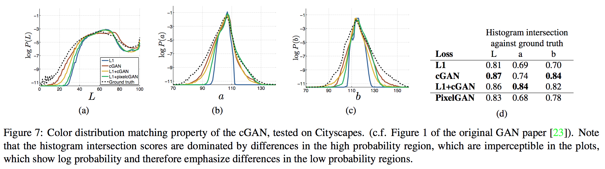
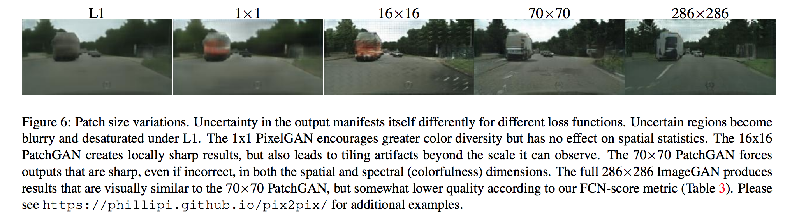

# Image-to-Image Translation with Conditional Adversarial Networks

# Info

- Data : 11/ 2017
- Authors : PHILLIP ISOLA,  JUN-YAN ZHU, et al.
- Journal reference: CVPR 2017

# どんなもの？

あらゆるimage から image へ変換する問題を，同一のアーキテクチャ，ロス関数で解決する手法を提案．

# 先行研究と比べてどこがすごい？

image から image へ変換する問題設定（エッジマップからの色付け，label map からの写真への変換など）は全て共通していたが，今までの手法はこれらの変換を個別の問題として考えていた．本論文ではimage から image へと変換する問題をimage-to-image translationとして定義し，どんな種類の画像変換タスクにおいても同じアーキテクチャ，アルゴリズムで対応可能な手法を提案した．

# 技術の手法のキモはどこ？

- GeneratorにはU-Net を Discriminator には PatchGAN というアーキテクチャを使用した．
  詳細はウェブの別資料に記載したと言っているがどこ？ -> おそらく付録に書いてある．

## Objective

- 先行研究の事実

  - GANの目的関数と，L2やL1 などの昔から知られていたLoss を組み合わせるのは効果的
  - cGANs では入力 $x$ に対する出力 $y$ に多様性を持たせるために Gaussian noize $z$ を入力 $x$ に加えていたが，今回の初期実験では Generator は単に noize を無視して決定的な出力を学んでしまっていた．

- 今回の実験の工夫

  - GANのロスは以下のようにした．L1の方がL2よりも画像のボヤけに強いため L1を用いている．
  $$
  \begin{align}
  Loss &= \mathcal{L}_{cGAN}(G, D) + \lambda \mathcal{L}_{L1}(G) \tag{1}\\
  \text{ここで，}&\\
  \mathcal{L}_{cGAN}(G, D) &= \mathbb{E}_{x, y} [\log D(x, y)] + \mathbb{E}_{x, z} [\log(1-D(x, G(x, z))]\\
  \mathcal{L}_{L1}(G) &= \mathbb{E}_{x, y, z} [\| y - G(x, z) \|_1]
  \end{align}
  $$
  - noize を入れる代わりに  Generatorのいくつかの層に 学習・推論ともに Dropout を適用した．
    つまり，上式より $z$ に当たるcode は存在しない．

## Model Architecture

### Generator
__仮説__
img2imgの問題では入力と出力では多くの低レベルな情報が共有される．例えば colorization では入力と出力では特徴的なエッジの位置を共有する．

__工夫__
このことを考慮して論文ではU-Net 構造に skip connection を各層 $i$ と $n-i$ の間につけた．skip connection は単に $i$ 層の出力と $n-i$ 層の出力とをchannel 軸方向に concatenate するものである．
また，ノイズ $z$ をなくし，ノイズの代わりにDrop out を学習，推論時の両方に適用した．

### Discriminator

__仮説__
以下のFig 4. の様に L1 や L2 ロスでもある程度の（低レベルな部分を捉えた）画像ができる．そこで GAN のDiscriminator には高レベルな特徴を捉えるため，局所的な画像にのみ注意を向ければ良い．

__工夫__
論文ではPatchGAN と呼ばれる方法を提案．この手法はDiscriminator に画像内の NxN のpatch について本物かどうかを判定させる．そして，このDiscmriminator を畳み込み的に画像全体に適用し，各 patchに対する出力を平均化したものを，最終的なDiscriminatorの出力とする．

__検証結果__
$N$ は画像の大きさよりもずっと小さくても良い画像を生成することが検証でわかった．より小さい PatchGAN はパラメータが少なく，より早く，任意の大きさの画像に適用することが可能である．

### Network architecture の詳細
Ck は Convolution-BatchNorm-ReLU layer で filter数:k を意味し，CDk は Convolution-BatchNorm-Dropout-ReLU で dropout rate: 0.5, filter数:k  を意味する．全てのConvolution&Deconvolution はstride:2 の kerne lsize:4x4 であり，encoder, discriminator はfactor 2 でdownsampling し，decoder はfactor 2でupsamplingする

- Generator(U-Net) : encoder の $i$ 層の出力とdecoder の $n-i$ 層との出力をchannel 方向につなげてencoder $n-i+1$ 層の入力とする．$n$ は総層数．

  - encoder: C64-C128-C256-C512-C512-C512-C512-C512
  - decoder: CD512-CD512-CD512-CD512-CD256-CD128-CD64

  decoderの最後のlayer の後で出力のチャンネル数(e.g. 3) になるようにConvolution （kernel size とstride はわからない=> おそらくこれは間違いでDeconvolution のはず）が適用され，さらにtanh関数が適用される．また，例外としてencoder の最初の C64 にはBN を適用しない．encoder のすべてのReLU はleaky で slope=0.2，decoder はすべてReLU．

  **注意**
  Batch size=1 の場合（U-Netでは推奨）では 画像サイズ 256x256 の場合，上記のU-Net で，bottleneck ではサイズが1x1 になりBN のせいで activation が常に0になってしまう．よって，bottleneck のBN は取り除くのが良い．

- Discriminator(70x70 PatchGAN) : 

  - C64-C128-C256-C512

  最後のC512 の後，1次元出力，つまり出力がチャンネル数 1になるようにConvolution （kernel size とstride はわからない）を適用し，その後sigmoid 関数を適用．
  最初のC64 にはBN を適用しない．すべてのReLU はleaky でslope=0.2．

  **注意**
  Discriminator の最後の Convolution の詳細がわからなかったため，公式のwebサイトで紹介されていた [article](https://affinelayer.com/pix2pix/) を参考にした．詳細は記事参照．
  <img src="data:image/png;base64,iVBORw0KGgoAAAANSUhEUgAABcQAAAD0CAMAAACCVdW2AAAABGdBTUEAALGPC/xhBQAAAAFzUkdCAK7OHOkAAAMAUExURUxpcUJCQjw8PENDQ0tLSzg4OGhoaGFhYWBgYC0tLS0tLTw8PC0tLTo6Ojw8PEdHRzQ0NEZGRkJCQi4uLkNDQ////y0tLUhISEpKSllZWVtbWy4uLk1NTVlZWWBgYGFhYVhYWEZGRi0tLS4uLjo6Oi0tLTw8PDo6Ojo6Oi0tLTAwMDU1NS0tLS0tLS0tLS0tLTExMS0tLTg4ODExMS4uLi0tLS0tLS0tLS0tLS0tLS0tLS0tLS0tLS0tLS0tLS0tLS8vLy0tLTY2Njo6Oi0tLS0tLS4uLi4uLi0tLTAwMC8vLy0tLS0tLS0tLTs7Ozo6Oi0tLS0tLS0tLTg4OC0tLS4uLj09PTs7Oy4uLjs7Oy4uLi0tLS4uLi8vLy4uLi4uLi0tLS0tLS0tLS4uLi0tLS0tLS8vLy0tLTc3Ny0tLS4uLjs7Oy0tLS4uLi0tLTs7Oy0tLTs7OzY2Njw8PDo6Oi0tLTs7Oy0tLTAwMDMzMy0tLS8vLzo6Ojo6Ojo6Oi0tLTw8PC4uLj09PS0tLS4uLi0tLTw8PC0tLTo6Ojs7Ozw8PDs7Ozw8PD8/Pz8/Pzw8PDw8PDo6Oj09PTw8PDw8PC0tLT8/Py4uLj8/Pzo6Ojo6OkBAQD8/Pzs7Oz8/Pz4+PlNTU11dXVxcXF9fX0BAQDw8PEVFRTQ0NEZGRv///zo6Oi0tLT8/P4+Pj6urq0REROvr69ra2vf390BAQEtLS/Ly8kFBQUlJSejo6Pn5+VJSUs3NzU9PT/Dw8GxsbG1tbXNzc6qqqs7Ozk5OTubm5vr6+pCQkNzc3IGBgXh4eL+/vy4uLjIyMpaWllRUVP39/VdXV319fePj4zs7Ozc3N8fHx7S0tN/f33BwcGVlZVxcXMPDw+7u7pmZmTQ0NPz8/Ht7e+Xl5WlpaaKiovX19f7+/tbW1kdHR5ycnKWlpYaGhsrKymBgYKioqOnp6bOzs4yMjFlZWZ+fn9PT00VFRb29vYSEhOHh4dHR0bm5ubCwsHV1dT09PYiIiJSUlH5+fqEEL9QAAACpdFJOUwAECwUIFQKItP7pLvvRShwXIP5pEwFw+/niTj/44bOKS/zibLvVRLT9vCAR0crs8iPACSob+Y3v3ILF2FWfqt41zh3KffZDMfAwLa2Y8XiH9FilD7VRNg1HtUpObSdybjLlsGCKeTt2JpVdDoZbiN64cBNV5pFlkzgeZTP176tx2WM+opuomp1/oI6UW/nxscL6asdgb6yr6fumgNJQSE3roWJ6TEj8dp/CB65eAAAgAElEQVR42uycX08a3RPHj4gkS/aCxNAb7mi4QBFFBf+LGqGKmiDV1Gi1j3/7WG1jTIytXjRNbfoKnvRFfN/k7+zZRc9ZOCvgbvPTzOeiYnfGnZ0z+53hsMoYQRAEQRAEQRAEQRAEQRAEQRAEQRAEQRAEQRAEQRAEQRAEQRAEQRAEQRAEQRAEQRAEQRAEQRAEQRAEQRAEQRAEQRAEQRAEQRAEQRAEQRAEQRAEQRAEQRAEQRAEQRAEQRAEQRAEQRAEQRAEQRAEQRAEQRAEQRAEQRAEQRAEQRDE40QSo86r7n//eXf/35dzo205dO1Wws3tQ7fyT7qs9FPOCYL4f+Ryri/S9MBQZdgfB/2BJ/AF38XXvpoJIJMQ35Sn+Ovoj3irDm+v+WvjoK/ReitlAMXp+rfd8/gUUP7V5Izsdm7E+k6arZG+r3XM6Jvux8uhFSOlAQdbM3I4cqqUxr08yh41ammYCBL5SmK3755gJEVPPFvin4pc0UoFa5HP1gZtjqxynhnj8jYTe7KD/sCTWIetyd/GULwrDACH/JtNYP80BXxp0YFLs3Hxs4RsQyXvGcbAURr4fN8BghFxd3KmUezQyLq06FrDGnn2tQ5r5nCf//Tc14ZTtW0k99PWismPmOVUqeHMWo270OVpdO6EOdjvMUwEecfKV/KV17GR2erMSI6eeMYUYGwc/VxDKsTYCRyuGVtIITuzGkVm+KkO2gNPoXsx72hyGgc8EvYR1VEWzuKK34E7hrHcmsMeqnwI709jxT0GmrCG8GNU7agTRjAi7k7O6FgTfW7JyFK+eaw1rJFXX+uQRSB1XUR1y3Wqto2UBtxSMfkSs5wqmdg+SrUDExvDHka8fhx69MNEkMhXMlfFZCFt5Dc7MpKiJ54xCcMsW7IwjgJj7/GrX8DvtRnMh3lZJ7H4RAf9gSdwm0F+X5TfpWHY41qGD823MMVIfWEdGnaKdiesd9jAqRhVsBRXHVaxar0czmLb+tqfXJoKRMRdyYlzhSh2ZsTY8jxs0ZHXyKOvdcobA+s8ikVkI2o5tG0k99PWismPmOVUKRxg4C0/axTvmd6IZbFsxxnXzgZBIl9JPCV68w9jLdSBkRw98Yy5tlWMz2vjjP3Gf/fDnzn4LxM1OaCqW9sOygG/SGLqzSxeWWPGvPNjf2GCD3NrYoja4Dd/JI3X1ute4yKudUjjWPQElMKKQ38pb1f8QkxsLNbwOR2EiLuTs4cBR5/LdqfpSXgYKW0qPGGiaIuOvEZKX/OHI2REYythTi0HOZ5WjJR+qi0m32OWUyWH029CfHOODaY1YgsYe3SYCBL5SraxJD6Uz6FXn32tkRQ98Zy5G18XX3dhdLF5nDyUyoRdvkNvVTls20E+4BuTr8PM1uR7UvzmiYwJpf1mWrfqK1hR9BoiFo3Dd4xb89SduG0lhxPkLAWtb45+xiwLRMRdyankU2Vbn8v5lKUJPZl8QmuktqkfML4sY8m9qHJf8+tt0IeEk8BN5VRKPK0YKf1UV0z+xyynSg7nbH1RjOnTQgE1RmwH6UeHiSCRr+QKd+L1DW922uxrjaToiZfANB+SuvNG6NvOzoL95pBXQbfz0Y0ih+06KAf8wrrZ1PLbgfmNnzKfLZzsTaEWd6LgMbz3cIgNIPepXDOjCaY4TON3+HocpdyI2O5c2u8PRsTV5IRT+eWELeKxKXAV78lY/2qNlHU5nK2wEVt05DVS+pqv7BrmmXKqZnXSkpHop9pi8j9mOVVNwqmJ7Qed0SK+hL+uzw17DRN/AXElA7gR31SQj2izrzdqEj3xfIkPYJWvcvaPASD9zSrFhXK6iqQ9m8hy2K6DesBHlPIbitoD0FzJ+shp776XyEE3c+iqWfbjMZfDd6zmUJysorTNG0AOWywYEVeTU8Axc/RZqPiI0HAPI3ebUkVcrJHa1/yjcpw0jl2naqiTloycfqovJt9jVlLlCuds8xem+jyMVnCwz8Os3ngNE0HjXEnS3v9ho8CoNvt6o8boiWfMEaI97BMvzYvzWhVjo2wNh/nqZJHfU5EmctiOg+tAMCI+Oo4Ba/P6awbztZyZdXb+ViA/dtLEIXxujm2sJDF7qToUYGS5cJ/9wf479lFs6QYi4kpyysZk5F6fLRU3hIZ7GbnWRRVxsUauvuYXVu/rbTiVK56WjOr91KOYgoj5IVVKOLu8j4z3exnxqKZWr+aBI69hIljqVzIIe9ckBOxqs+9pRCL+YjiGwWVvwkhaqzw0jg2+4EbtHWPbS87dr8phGw4NB4IQ8UoS89adt22Y1oOBt85TDb3WZPfaw4HPhmmuK91X2O9RHL4AYht3OInXb8ypUEAiriSnf786xB70mVUMGJXHjNR1UUTcXiN3X/OJmZUBc6w3op7KHU9LRvV+6lVMAcQspUoO5yTN5+yLIaY1ClXFZkt8EcZX/TARMPUrMVGx/8PEsjb7nkYk4i+ECJ87f4jtVvuJjDLQB6REMfYi2yiH7TiEXAeCEPHyGnJiepp0nobeRvWdiOHDKynsRocyBsVGSmRSzE8PDh+s/UOLK9yljESIk8NNKOy/iD8k5w+snN7rc0/GmcS9jFxtShKd+hq5+pqPzEWtJ7rlcmiIpxWjegP2KKYAYpZS5Y45vIrqgoeR/Xg4r7VV7TDxFxBXEnU+Cx4GhrTZ9zYiEX8RhFeQX1dEPY/ymHPP9wMxtxy256AeCELED03U7PGn6rxzjFiPVlkx1D+T0jjs1Z80OLYeT5EcNpG0D+whhwcO/M69lJz3uLB6xRaKoVBEaHhqWXy66WHkblMPonO/Rmpf85V15M/UcnDH04LRfQPWF1MAMUupaoy5K1X/zSgPI7aISe0w8TewrmQeO/YbgCZ3aYtGJOIvgZ5JjLl+VXgf05n6L54N4o1LDtt0UA4EIeKvgYl4XRMT9RdzfLr+YO9m5iI6h1fiSULOf1zEZYdbGPbdWMB10iaPbPK338mXkiM3i2XnuRT7GRWtUUObuhedhzVS+pq/cIn9RymHhngeN3powNpiCiBmKVXNYr6qd2svoxuktMPE38C6kg0nTxWUurTZ9zYiEX8JGp7CuPPXlCZm7Ns8bKCygSvnDX++W5XDdh3kA0GI+JZh3H9alXM+VarAHGbvnD9eNR3SOiRQCjk7nudMdog7D4pFMig7toF8sCklZ8buFVGYyeQI2zbFZ5qxKXNLa9TYpuqiI62R3Nd8CrqQvhVfL63359KplHhaMpIbsK6YAohZSpUcTmLW/p0kdo0a0xmdnDpT+nl9Z7nJMBEk8pWcOnk65O8KtNnXGpGIvxDik8jE7mXKXu1PiIannV3JTetNoyyHbTsoB/wX8XARhbBNF/uMvPVb8pcD+NmSQziFdFhcQGnE/WZ1sCLeMydDQYp4Y3Lq293bdpJjWx5GDW3KER15jZS+5lfnsX97/jPW4vKplHhaMpIbsLaYfI9Z6XdSOHPIXzrbKXtMZ3QCU2yKd0/V1a/JMBEk8pXMIRqxczehz77WiET8hXCD7JAjaewH8tZHIMtR9LLIFGb464WissXWiYP2gD8i/vFhf+HUeqzKTE+cRjH+tjWH5SqKdxNpNMQWWUH1YCKH7C4LUsQbk5No/LMoLRnJoiOvkXdf63Q31pruR6JYVE7VtpHSgFsqJl9iVneelDyvcG2LXCEa0xp1FXHAG0zXNZJh7TARJMqVTFrvINm6kY91YEQi/jIIZx8krYetwKwt1vL4H3vnFhPHdcbxA8tutRfMUrxRku0t4HXxAjZgsA0Orc0lDjYFUgwY26CAXYqVmItZqGOzaINVzP1eDPG1qfvQc9ZyK6y0atP0qqp5aGW1D6mrPqRRpfQhilopbVXJVTozu+zOmTkz7M4umTPL/CWL9TBn5tvhzG/m3P5fGVMNnfvRwX3ndgddL5QXkPlFXCDegUHcccnCfCjelxxpAfdxdrDeRfAPbWOOVNUb7oLYFIiLLw6JzxHtFIYO/jeSfa4p0xWEDpdcKWaa5Pipot0JfwBHVJniELMkn8HRelRf1p0beOxJ7XS5GLm6z+YiS6fMy8Rmiv9NnFWooOSYGWUo2mmLQFzS5h3P+hJDAdyp/pNWNeLfX4a255mfmYGVAO4CG0IHuk0xFpD7xaaoyNka1ZlSqjslZhSUX0zZ/HCFF4fI54h2CkEH/xvJPtcUth9O72cO+XybSXCqaHfCn6eRVabYY5bmM2jtZfYxF7QCuZ2Osl60xbvK5d4NNlPYN6l2MZ/bzyjbaUtAnG/zjlnBC7K+KC4gdKpXXaZ8Z7jNlXLIHacCkRxp67aGIrk4MV3BaJ9rEdSTrufcjrjsFFPti3/MOZ2HNn7aNRxS9c0L/yY5zlaD4p0SX5jNO98KXpj1RXEBgVO9Ll26dOmKnzCbd54VvDDri+ICAqd6Xbp06dIVP2E273wreCzrC8+8P+oCmFO9Ll26dOmKpzCbd54VPJb1hW/eH3UBzKlely5dunRtitjVezwreCzrC9+8X2kBzDg/EZVsVFdKJpmkqCz9ttOlK27ibN55VvB41heeeb+yArhxfkh3nlRXccylBj4H1dXnFTx3VA750wov9Xc+pa6UTGR8XeWY06IPOU3lkF/XsRyVAjbvPCt4LOsL37xfUQGBcX5Iz6hMke06xLUI8c+oHHe6gpg/q3LMT0cf8hdUDvkpncvRKGDzzreCx7K+gLB5v7ICuHG+DnEd4jrEdYjrEI+nQjbvYSt4ftYXwDPvV1iA71SfwBC//0AdvREDxN9QSTrEdYjrEI+bRDbvlaiUl/WlBjPvV1SAVcipXgDxd76vjt6PHuIm6wYQ/8X31NFvZCG+NOyWhvh9lUL+24YQt8pC/N/31NFH8hC3ykH8bZViflMe4u5kaYi/qVLI724E8bTtOrh5Etu8X0IuXtaXDsy8X0kBTiGnegHEf6oSRX4YPcSXsus0CPEUD5zSIMRvwXE5iP9Ipbh/LAvx/Pm5JGmI/0SlmH8mD/FFT5MkxN9SKeRfbgTxYe8tHd0hhW3e+VbwvKwvlZh5f9QFRE71moW4NA2phngtrHBoD+KmVFirPYgPSz556IV4P/Qkaw7iF+GQXWf3ung273wreDzrC8+8P+oCIqd6zUJcmoY0Q9zohSNAexBfgj0pmoN4ExxK0xrEk3rgINAcxBfhmM7u0Nslz+Yds4IXZ31RWEDkVK9ViF/wwp0a7BOfhF8E2oO4bKuHWojPwTqgNYj3QZ9JcxCXbD1sSWE273wreHHWF4UFRE71WoX4JGwB2oN412r2Xg1CXLbVQyvEb0JPs9Yg/pIX3gZag7h062FLCrd5x6zghVlfFBYQOdVrFOL589I0pBjis3AUaA/iMn1A9EI8yQcXgNYgXgfngOYgLt160AUEVvCRZH2JpICkU72WID4sQ0N6IT4iHABKMmgB4jJ9QPRCfAH6krQG8fIh2KQ5iMu0HnR94tIQxEnD4dYG6iFeIRwAMvkmuqiHOKEPqL+Zdog3e+BNfMtdI/UQH4evYf9PH3HQD3FR6yFf2GxzD44tiNrNnQMdZ0+CxrYicLotMJPuiTZ26UpRRs2XKgOJx0ynBjpqTnM3SNHXrlwradRf+BMJ4qTh8KXp8RG6IU4YAFr2++emUuiGOKEPaHlmtIluiIs7Juqml3c6qIa4Fc7jX6Z5zVdrpBzi4tbDdr+vj3cvF05yKz7HcX+7bq4PuKYXOUFVcLazDbkBeIHt7UXmAeaeKCzg9qnKAKDRxn0sLdcpnTAQJw6Hp/v9/ht9F+iFuIEwANTHBO2fmbBSDPERQqtngb3WCw30QjxN3DGxk4nZV5tGMcR3wAnhy4rfP718y0QzxIWtB0Y32KjXH5gpqXDt7d+9ex/25GCz5Pa8at9bw4AZh/hJZCvJv3Aqk3UFOYvyjiS/2I3M+ReqUJb9wgsuVKZTOlEgLjEcvsICMVh7aIQ4aQBoxB/Q4lIyrRAntXqauKADTR8qIT4Oh0XjRVzMa7N3TZRCfBv05gg2TXAx91xPoxbi1ux5kY3EKBd18IE5Af/8H+YQHz7iw95Yz65fAeCcAOKGg5zXEyg32/aC3MA+BZYzjVx6BOAsPpykYzpBIN5HHrOaDQLRV2unEeINXrhNtNHuX9fMKJ0QJ7Z6kqbXr3XfdhohTkIL8AVjXrmeTiPETamwT9RFGAx5bfb203RCXNx6AGAwFPVdkz3b/w53jA8/gmErm5OoNFD9bTjETyBL4AV+F3qZ+XeFrXkmdh3jfi4h2dbpE0/vShCIL9WRNTEEh0nbK0JAXPM9pSLE/8Gce6VCJA/0ijeGY/b71YZ4l5Wgag8cI2xeCUU9/SuVIX6LEN4ifE28kVc/HqoI8beYcy8QYh6DnmrhtsFw7XhSZYjfIdUO6wL0jog3hqNe2REK+re8Z1Tluonql3GIZ6GDWZw60DVwHqH641ns75IOInRw4MQWyj01PD+VGBBvidIs8488ID5UGeIRiyKI90QR9uNw2A9UhriSmNWE+AfKqvT7KkNc4Y34GP4veJC/8xbQXkPBzGIFOMQHwuteDgNw3sJ9OAVAznEzm7PsasMWYfhFaccIzUF8vJagunk4Sdpey3urnbmjIsTvMef+dpNQLbClSayp0Mvh4pjaEG9JJWgV9pA2hy/1mtoQ94mjG4IeQszT4aB/ryLEHzHnJlxTDxwSb+wJh/yMyhCfJlUDD5xPlY162gvfCx7kY96b+NWghRNwcRDn+g5SzMjdjQoag2L7w5Oe2+dCyMx2k7+S0VGP0IEc9QG792jhpp9DuRkNfRDfFuFweEBzod7lEQd1feLVwuljWPfhjdo0OmenSCwhDHXlzw2+RF+fONmuyzQTjPlGn5G+PnHyqtja9So9PkLjwGYh2VPnOu9GNK4+/gF3jF/fh+G54l9HHYGxlXoG4nsQ94u9CLnPoDzecbjucfcu5Ap8NJw3o2fVh7gFXd7sU8RgRqMNiBPHrMI36dqOqWQaZ6fsILsxsQP5M5NNtM4Tl1pCeDM4ayKfxtkpEnZd1kAnLTedkz6IT8JZQszLXMw7lpLpnJ0yRvbUaQneiIWB14CHLMX/8AHfF/io2cbdxK+ys1MyEevHynaBu48gG2f25NjVXlnkquf26UTFJZaa4HBn5VaAuKxjREJAnDQcHpr2tj4PmDqIb4NeYn9ez/Rsf/CtkUaIS7V6JriXQwed88Ql7LoW2Pmnt5PonCfetbpKmI/gWGGq9PV0Whf7SHjqsG9ToRsRGCrg4z/d+/ka9PHtyL6J8soBOLGbhXgvyjMB0Mp8doNjqJRdlJDBbj+Ayti/4wDqPR9ge1EVukhBf7Vzsy0b++QcIxIB4t8VT6Zdv3eDb7Q0Qpw0fYzV9r7wWnAKIW4l9wEBcCPQ3qES4kYJk+LlxYVQDaMO4mRnNOvMaIiSFEJcwlOniX8jMhSvy2ZHO0cx9NnzkM2ViQ7vQZ3gJELtZQW2PBcD8VcykeVqdy5CZwE4aWY+f+MA2uM0FCBb6cvH61GHYwuMajZ7hY4RCQZxKRqyNZ7fD0oZxAdhj2Gjy08hxCVbPfyhc9ogLmXXxd+PNoiPwCEjIWQjr0rTB/Gu1WzibGajcEAibap2SfhXSikp/Uru2cLdbH94YztCVceaC9hl9w1XqxBCmVymm1O5rCtrKbNHzjl2q6WEBoZfarODjG+BoktlZVnC90n7zaWdhlhPIGNlSVR+v0FbEJdLMQOohXiyB/YD7UFcqg8IF2UQ79rApJhGiDsqNp6NQB/EZzdwEo1AJhsqYn++cih8V5vyne71VT32kCtrYavTTseLMtsnbrFd3s1Of8w8gr1Cs+v1oHcqtuOnyVhZksExvRK20dMAxAtlE2tSC/ExWAG0B3GZVg/FEB+OBC2UQbwfego1B3GJ1kNEunzwqxynn0Xtmuvt4CBu3lNwovV8e8AOYP2J0wP97338Txjjs01y9p2k2Gl56zZ6GoD4mGxiTVohbhySS6pALcQj6QOiDuKR5eylC+KGSFLjUAfxihgSazbb0BMpwPGiBZVoE+LIxQ49OhGy81smj/7KXKx/3Y+g2S0tydl30go47ARs9OiHuHyKGWohPkqcPkY7xAs9kVVGuiAe2TIJuiDeB1NNmoN4bIk1sxCqKt2NUI1DoxDnOu0LEToa2r4TPvgLd7X+Cz0xmLxIjkNJK7RicHEwmX6Iy6eYoRXiXdmrXRqEeKStHqogHiFaqII40RmNdogbYkyseaLXYj5w5f/s3ftzE8cdAPADjGdEoKVmkl/4jeIkhGcg5jXxQAiBBhICFEpbQtMMkNLQH9J0OjQT0pn0MZ1Ap5226fQx0z/g9OUljHEwNjXBjm0ksLFk/DbGbxswj8HYvJzu7ul0e2tLe5LvfFL5fn+RTtLqvlrdfnZv73T6NAXPNtEQZ6e2K/PAmBQ/4B0KV9c571+fTTQ2eD/5T9xluF/IZgSTHPFoh8OTHPHnvAeV1EPc2hxQkiFu9T97kwrxA96ZSsohbmnvIXak6GVlNcTXhu8biP/be5/7hscy+GvV0KvVJDXicRwOTyLE02Z+MjEFEbc2B5RkiFv9z95kQvxbf/G+nnKIW9t7+L8MDfHXhyF+0Nsdrq6L3ldnJhhTvPsTKMRdNCoj2adTvveDqSmIuPkM5ZRBfNFze1IP8W9+Zu0/e5MJ8XE/t7SjllyIp3/+mYKImxD/o/d2CautQe/+RC+am2b17DtT6Neq+edbi1LlAlgpeIphKiJuOZL03+5T6RTD1EP8CY5oiI+b4r13ilRWzUXvhkTfe4PVs+/MMxTaX5qxv/FDxBFxRBwRR8QTQlx5ar/34lc9ZYe8f0v0aIH1s+9Me0V/YlcT1RYQcUQcEUfEEfHEEFf2vEoPMz5/IOF/ILJ+9p1pllm7migijogj4og4Ij4qxJX0b7x1cMOihN95z7+eT6TwNn4GBhFHxBFxRBwRdylsuBgNIo6II+KIOCLuUvzG0hUjEHFEHBFHxBHxpIzRXIwGEUfEEXFEHBF3N0Z3MRpEHBFHxBFxRNzNGO3FaBBxRBwRR8QRcRfD6hUjEHFEHBFHxBHx5IvxNl2MBhFHxBFxRBwRdyOePagg4og4Io6II+JPeCDiiDgijogj4og4Io6II+KIOAYijogj4og4Io6BiCPiiDgijogj4og4Io6II+IYiDgijogj4og4BiKOiCPiiDgijoGII+KIOCKOiCPiqYN4n8+IAVUt9lVFBPPVhO8N9Pc8ON3O2TZ442xDo3a/RCta09ehLV/h3s/X7gjiwipIBsf1pwZ8udqdU9ce9Jyv4QpV9bfd7wzf/4KVLK1qH7kOEHFEHBF/MhCP6YQlDH2+Y/SmlEepeIwRLwMj8lW1CJr1bPshj92er2dPBpvCVNbU++lyoIV5N6AXbi5jn/gY937Q7wjiwipKAb7Wn7oIl+lNYW+QPVk3qD1c0R1iywVH2GJ55ANfrhihDpxC3NxXONj32Ii4hZxj9vFiztH7eNsQF1YxYkuMVc/isCR6PSPiKY64xAkLGKqdALfpbZBHqXbMEQ+d0+O/NG+o7+DzrngMcLR8qPc2+agl9OG2ZvDW3brV6odgg4Z4Hil6l3z6QJsmbFfkDaudQpxfBUEcGkyId3aBv653qDwEAfZEFan5/PKhS3dJ9bYzxL2kZF4O6YzONQ6vA6cQN/cVDvY9NiIuzVnSx4s5R+/jbUNcWMUILTF2PYvDkuj1jIjHFx+ufGHkKxIuWLfQngIvrZ0QB+IyJ+QYquo9CAHt/SspHqQgQ6R3zBEv4hdJ3tDG530BoInl2x+AFnLzAKCc1UZVAQQ62Sav7Tz4WtkyaUKlDs+JC6ugiB/N5WRpzIFz7AWFrawBl5yADObFlTtaJ1kOlzSjzwbZslAHziHO9xUO9j22Ih47Z1kfL+YcvY+3E3F+FcNaoqyexWFJ9HpGxOOIp99fQbae1xZvI/f3vjlfi120gWcvAfBkTx19gZ3vkte/+CuriEudkGJIdumCoSYo09+xGvyuzIkPQ/yQPnJheXf64WH4qSPgr1Jzc+BwePlqDhSUGIirai0UnHIH8UNhlTVZaiHg0xaPn6BPdIP3WPi1hwFuGoir6mAAHowh4kVj0/fYinjMnKV9vJhz9M3DTsRLYw1LZPUsDkui1zMiHkcsBs+WXb99EzLHK8p7+o7NPkVZlQnzst+YBHMWjrbAaoDMfStg4/ctIi51QoYhictw5iqEcpMN8a8qob4ikncZ5EWmM/NuN6iP4WhkJnPQT/ZWOcQLA3DDHcTv6wNEKkufn6Sh1/XJ8o6+EPQYVNAdYgNx8m3luIe4U32Pk4ibc5b28WLObiBubonSehaHJYi4HTHdM3kNne9YCosV5W34/WwWxOdseCVNUabOgNWjLLDWA5vIcHw1zEu3hLjcCRmGJOrIe9RHyiUN4kO+ANzR874ShKbIc3SnNE8f1TArSFlukyeF77mDuPoQMnJ1WdogcIV/+U0IGsv9tCyHeA1Ao2uIO9X3OIm4KWd5Hy/m7Abi5pYorWdxWIKI2xH74KfsdissVZQ/wN/1x1dNnr+H3v4E5irKwq3ag9vTEiiwC+bQu7Nfg5WWEJc7IcOQjFT8/mNqDxQkHeJqkzZyoXkXk1bLP13ij8yJkmiBoybE78B1lxAvzNHmqKgsl4SjfEPa4ePw+BDgCC+LGoJrriHuVN/jJOKmnOV9vJizG4ibWqK8nsVhCSJuR/xu6SZ2uwM845RX4D398V2wjN0uXPBdJX0WfJven+b54On4C3z8znT2RCZstYS43AkJhmw2sZV19afdRrz5qB41GuJXtJELzXtQaHOkFXMnZvVAoIPf5C/DI9qEcvT3K3MMcX4VVBba+s6HZakT2lxRZI9fOxWoyYR4HhlrCXUwdog71Pc4ijifs7yPF3N2BXG+JcrrWRyWIOJ2xstkYD0hyzP+o+3bV9HlWaMFXiUAABFeSURBVEDonTBbe/IZoChP82g0J1Zgh2fyXkuIy52QYEjGLXfZ9h8p6R7iRvi0TV4lI5duLe9qOnri4jzAcWOpASCX3+Tvg7+EP8GryDHE+VUwxIkWGYWaLPV09MRFZWSaVlt6bJIln3xgoQ6cQ5zvKxzse2xFPFbO8j5ezDl6H28n4vwqhJYor2dxWBK9nhHx+M9RmQtvKOtg3j88pK3N+oiOm1etmbURZqxO11EmJL+dcIF1u2d4dls7sCl3QoIhRTtYwlQMNLqMeGuxHiVhxMnIJVDK8u4EMDXq0wBVxtJZCAjTKRm0CVXr79foGOL8KjTEtQEilaUW6oQet4VbyiFfiXl4eESsg7E4T9znZN/j0Hniw3OW9/FiztH7eEfOEy8aNiyR17M4LIlez4h43LELJk1U3gfY+MHPNm+EJS8pb8LOrI3LVxCgdZRNhsdZYDP5iqYp1hCXOyHBUFUfwqV2EoWP6NaVXHPiKh253K6geTeCcRQovLvJ7S/fIq/gN/l7UO/SnLgaHiBSWXrpATSV36uv51im5x9wspAPWD12c+J8X+Fg32Mr4rFylvfxYs7R+3g7EedXIbREeT2Lw5Lo9YyIxxu7wbNVUZZ5ZuwgCwuWwpbxxODN2xTlh9+BH7FXrAdYn3iB7PVzJy+ZZu3sFLkTEgzpZLgeXR2xEf/8F+aY4jzibOTCNvl8MH599LjyjnoCLvA7JF+bEL9O2oNriBMvThZSWfq54WHjyaKay+Bt53aA/MW8LGQsedW9A5sO9T2OzonzOcv7eDFnd+bEuZYor2dxWIJz4nZF+mLwfErvpI1ny2sAXgDIZD+ynAbztEOUAMYEd9wFSKycRE8mt4C43AkZhjfAW6lFeLuPjvjwcB5xtRsCTTTvIeg6pR+1ekQAvwChY1wtXOMRr47dSp1GvPAklFNZ2psNWdog1N4egluRIxEX6ZEqTpbrMY9cjQHiTvQ9TiMeyVnex4s5u4W40RKl9SwOSxBxmyJtPWRtMqGeBWuWhE/3ng0wlZH8zjMRlOMuwGITZO21grjcCRmGleHn6aZ+Jjbif/61GE85j3hFJTTTvBu9kU/WC/4+tTADasO7lH159IMam3x7PlSqLiJOm2czleUwHLqqPTIQpBOg5Dv4MvzabvBX84g/YF2oq4g70Pc4jries7yPF3N2DfFIS5TWszgsQcTtiYnLYcl080PvwstzYKd2fz6sZSTrp5wkUEDRdf+xFcTlTkgw7DQO4x+hg6x45sRHEyMhXlsSCSNvtTQA7PdtPQAt1KLCe8BOtm3wQz79LXLH/SAEixniNaTkF4M3MiD0JWtCnfwbOoM4v4oI4uxqSzdJM70LOf301x0NedBFRl0V18HfRK1pLAL2LZRDCynYXtrwEMK/X68dOeWxQNyBvsdxxCM5S/t4MWf3ENdborSexWEJIm6P4ZmwdId2d1n2Sm2k7YF1W+CXWjOHrAnpyynJFOUX0+MvsHjWx+yJDwEWWEJc6oQEw17j5FQyEhhyFXEuBo28yQatXS6oCSBQWVsZgvCec3UQ4FBdPVkuoG1lwCjtvSacG0DPhHf4FEOyCgNxQghFXK06AZBR19pFEmVd5XHypQTyz5Bl/4UOlbu0HkBRyfA6cA7x2rHpe2xFPGbO0j5ezDl6H28n4vwqhrVEWT3/j717jWnrvAMw/nJzZ+IuqIz2A99IaBMTO3aAEG4BUiAhQEIIBAoJHbAGmgaSNoxQkjZJaa69LJel2qp2UzVpUs6fdmurTeu6b1krVdO0bJnUduqnrdo6ZdPuUiLtdt5jAzbl5gPBsXkeKbE5nNc5HMLPR68PPpMPS6bfzyA+9zKKZE1a8P7qoMP7JDW5JDjF3SxFSrWUBFYoSbQxoEn/fr5Zn9RnzAnxWZ2YGcP3roe8IPRL+eF7dyDiv/hb8I07b3yk31v0Z7+5EfzEj1633sjz6u+sqcQg4r+++vGfP70SZcT1KW5/sTT/7J/Ws8r7Y+9M868/WW+P+sHNcYHMr+iea//7x1T7YDFOMZSbt/G55zadYjjVNs/2HD95m6f/73F73or2t1P8JM6ynycflky/n0F87g2L15ccSJ2QfP0LmDWpkq4cxVJq3t9UFjavbWfADsnXky+5qZPfVGVaxGdzYmYMb42dHR48L+tW9BCfS299eOPNt0J/Uemn7978JOJHWdzLs33/9++GEfrpmzc+fCfSB1kcxBf8uWcREB/f5lme4ydvczQRH/9JnHk/Tz4sAfGFeFHTO7ELU1StuBorG/OlNEGpzAIpXv+oN/hOKfYHKDUiUlE4km/NxcwNcTtOTMZw9u4MxBcmrrG5WM89i3x5toV5jl/cy7MtyH4G8TlXI6EmJ3VsMW+zAr+j4/a7RDb0O+Y5QCnH7gJzpS0dU11H4k67xiaIxzHiCxPX2FyUQNx2Dl9m2sRRd7l7YQY4eqvdGVN+BsRBHMRBHMRjOBAHcRAHcRAHcRAHcRAHcQJxEAdxEAdxAnEQB3EQB3EQB3EQB3EQp0XpSw/sAnEQB3EQB/FY7ZyxEsRBHMRBHMRjNPeFVctAHMRBHMRBfE7lbl13h23R08ZZ5sRBHMRBHMTnVqocubM2aJdxdDmIgziIgziIxyji543tCsRBHMRBHMRjE/FXjYEWEAdxEAdxEI9NxBOOGxcjHOIAcRAHcRCPf8R3d+RYt/d2PKbSL6u84dLSFTnjiCfv7mgPW6yUu6f05CN7lcrt6As+gE/flHdkhq8X0hOPv/y1c0Pz2syLxvGECIecem4ZiIM4iIN4vCNeFbwgpUvcKtV1xLoUQ9bmIOJJTVKcF7ZYVVZZb/H9bItP8hP1WSwihXp8l+wIWy90JmTA0J2ax3RIy4DxaqRjBkdHLw0mgjiIgziILx3EnWv9rXv6OsUfQNw0PDtNhS3uE1flnrQ+r2xU2dJmjrss+lqXKrkhf2foeiE9bxgfvXHr/XuM8xm2t3K7cSniMctGzV48tQvEQRzEQXypIC7Zes4iUyRNI57UJRUp1szK+OK0Atmn1+7Nl+p+68LETU6vyzzcbZWDYcMnSnvKeEPvrF/92Hjc7kYuP2pE/hv3jhdHrV65uBPEQRzEQXxpIJ6u764T2WreH6oVT07gNc7xxSWSHTicflRGhiRbqaSGNSelVanD5jqhwyc6Y3wQ2Fs3jAG7h+JnjadtjHplNNgLZ58BcRAHcRBfCoi3Wve9stm8XyEBlEMXV1pXmjfbJx5HqmwyD7vXr5B+pcqceWHDJ3rIuBXcXd8zVj5gq/PGqvM2hn1jdKK3r4M4iIM4iMc/4puDamvEJUvqN419GLxtDLyKqedMvOq0nFD7pS1XPEr/CRs+0XnjRnB3XTMWt3+HID4K4iAO4iAep4j36ptkp4V4TQji/ha/HAx8OL64zpoHN2uXLPPPRuVxJapOZ06PPBK2Xsg/8LLxx+AP0/VVh75op23G0eftjBs/En/xpYvfZToFxEEcxOMS8bWSqwJnCk5G/IjyVclwOOIdUhsYdtk89F5X5X3CWaTUiDQX6UeZGvFDxtUfWHvrvzbfSdZxt7HNzriU4IT4S99y8MImiIM4iMcr4lmBiey+qRBXPVL/ZBjO1dJgnXmSUaEnwrtkv55e2SeNrmI1HeJqpfHxh1euvPfz6xdybW3h140DyXbGfVsTfn5wJ6cYgjiIg3gcI35QPOaB6h7vlIg7PLI6HGe/dCWahldKgU+pE9IgmUrliVOTPh3iy48bxrWP3zYuDNrawOQB43lbA8+NHjjTO/YBiIM4iIN4fCLeJtJZ6nd5sqdCXNW4ZDhsca5Xyh7t90iB/myaUxqSzNtskaHpEVfJ546aO+pBm1d02Gbcbe/MxG33h7x7CoiDOIiDeHwirpo7RapqW/xTIq4KZa07DOe0jfki3tpya0mRNOmbw5KaMQPiSq3b9cwmm5v3xFPG/QvwVYI4iIM4iMcp4ko9WR7RnHNCbk3G4m3cc8ZDCsRBHMRBHMRjM998LqwJ4iAO4iAO4tHtaeOUAnEQB3EQB/HYbGheF9YEcRAHcRAH8ah2yTijQBzEQRzEQTw2O2QMJII4iIM4iIN4jLZ91UUF4iAO4iAO4rHasgQQB3EQB3EQJxAHcRAHcRAHcRAHcRAHcQJxEAdxEAdxAnEQB3EQB3EQB3EQB3EQJxAHcRAHcRAnEAdxEAdxECcQB3EQB3EQB3EQB3EQB3ECcRAHcRAHcQJxEAdxEAdxEAdxEAdxEAdxEAdxEAdxECcQnwfif/8kOv1nHoi/E50+AXEQB/E4QfzqT6LT9duAeDSziXg0mw/in70Rnf4wD8T/GqVtvmYf8WtR2uTXQTyWEI9mIB6ziEczu4hHM5uIRzMQB3EQB3EQB3EC8bn22n3R7Ts2EH87ut0H4iAO4jFe2vLo5uBbEIu99oXolmNjm++K8jb3Rr7JvVHe5Lv4n05ERERERERERERERERERERERERLvQy+biKimO3QpceW5Nc9uDKZbz4RxXwJx40Hl6Lig4ZxiO8+EcV+mw4sRcVNwx/ne09EKI7hREQojuFERCiO4USE4hhORITit7skm+/ljOFEhOKR1lg0fjelW1WLb4Z1zRWsCnoCt870qdZye9swnIhocRQPQby2SeWOpMywrrmCVV3bDIi7s8UW4hhORCg+L8S7mmZZd/IKUyGe3lBsC3EMJyIUD6vlq8Ub+vOU41hxg6dZKX/r4ays9Un7T+rPne4fW2wi7tlhLtlfd7ig3tPmyVOZ/voN/cmqcn9fxZaDbuuhyv0NZaU5eoX2otZOf1G3cpemVrRqxE9UNHja1WP9gTJVZ7/PDuIYTkQoHpajKau7u7hLFboK2+qkW9V3+ofrpKdETJfTXDvGFpuI5+82Vz/pr65Ys69dfEdcXe0Pb2lSpzvLKu8t8OiHSvQ2lazoPKhXaHaVNXYV9CR51pSkeyVd9bga29c7m9PKAg2rFJVnA3EMJ6J4VzwnYe7p00OapUapzC2ZLv0q5OrUpHrtcdHq5C3mxysaescWTyCuZ0uqxef3ZCg1LNWnXT6ljom+/HO5bDYfb32GuUKbPKJf2Bx25Sm1Q9Jz6kv12A2hGxtEPILNTcBwIop7xSPprDmkMCBru5jcmhjn1n/FvB3xqNMm5v6R8cWfQ7zqmAVx5ekya/ST+ki8oaxyq7LmxNtkr0a8Ts+kJznTM+Xy3r17CyXlc4gvi2iDMZyI4l3xVRGkEd8YeMXyYac+LP+yVNfrQ+9nPSpTfHnO1vHFkxEvFz1DrsrqNPaqVaxJ8XKPyIb2AOJujfjqLr04Nb1bArVmB+qeQDyS7f0mhhMRhVeXrf9277OOkjPFPYa4I6vn3lTHjrHFGvEOPbMSRHxP4JST1J5QxM3HWZHtdFuI52nES/16YUN6uwxl6HYeDlQ9MZ1CRETz6HL+/9u7g5U2oigMwLepWURmMRBcuQt0EzUmVUpjKFVBWxOE1kYqBNOm0C6qhCB00636CD7FfcneJE0dsLu66/ct5sK5Z2b5M5zNyUPYij9nf9bt47AI8TDeaf0I3UU5hXhjHMKTWiv0JtNxSqeXLo7iWSHEv7VS4r+Jg9TwO8Q/ba5Nm6rNyot0X+0tPRinAPAvPjb621v9jdAfrZbev2vfh3i3ku2GP+UU4pPG6vn1QStc184Gsfm9MvzQXd8rFUK8tHxyXr/JyqnhdB7iV6+/5M2NWA23b4f5afqMEAd4XJ+fxfhyN1zdZnH5MtyHeFjvpMeinEK824nZybgVDo/jMDZX7jbjwaQciuOUwU4Wa4fThq/zEA9He5WsPaqGi1dZHN08F+IAj668P9s5vFT/622hvF2aHStr86P+cMnlRV5omMnn74SndYuNAQAAAAAAAAAAAAAAAAAAAAAAAAAAAAAAAAAAAAAAAAAAAAAAAAAAAAAAAAAAAAD+c78AJa9isDdaIZ8AAAAASUVORK5CYII=">
>The structure looks a lot like the encoder section of the generator, but works a little differently. The output is a 30x30 image where each pixel value (0 to 1) represents how believable the corresponding section of the unknown image is. In the pix2pix implementation, each pixel from this 30x30 image corresponds to the believability of a 70x70 patch of the input image (the patches overlap a lot since the input images are 256x256). The architecture is called a "PatchGAN".

- Weight Initializer
  重みは Gaussian ($\mu = 0, \sigma = 0.02$) で初期化される．
  BatchNorm2D の初期値は $\gamma$ は Gaussian ($\mu = 1, \sigma = 0.02$), $\beta$ は$0$ 

## Optimization

### Loss

- Generatorの最適化に関しては，標準的なGAN（[Goodfellow](https://arxiv.org/abs/1406.2661)）に従い， $\log (1-D(x, G(x, z)))$ の最小化ではなく $\log(D(x, G(x, z))$ の最大化（ つまり，$- \log(D(x, G(x, z))$ の最小化）を行った．
  $$
  \underset{G}{\operatorname{argmin}} \ - \mathbb{E}_{x, z} [\log(D(x, G(x, z))]  + \mathbb{E}_{x, y, z} [\| y - G(x, z) \|_1]
  $$

- 加えて，Discriminator が Generator に対して学習が遅くなる様に，Discriminator を最適化中はロスを$1/2$ 倍した．[コード](https://github.com/junyanz/pytorch-CycleGAN-and-pix2pix/blob/master/models/pix2pix_model.py#L81-L82) によれば，Discriminator の最適化は以下の通り
  $$
  \underset{D}{\operatorname{argmin}} \ - \frac{1}{2} \left\{\mathbb{E}_{x, y} [\log D(x, y)] + \mathbb{E}_{x, z} [\log(1-D(x, G(x, z))]\right\}
  $$
  
### Training

実験で使用したデータは前処理として， Random jitter で256x256を286x286 にresize され，ランダムに256x256 にcropp される． またmirroring を施すこともある．

## Optimizer

- 本論文では minibatch SGD を使い，Optimizer にはAdam を使用した．ハイパーパラメータとして，
  learning rate: $0.0002$
  momentum parameters: $\beta_1 = 0.5, \beta_2 = 0.999$ 

## Inference

- 推論時においても Generator はDropout を適用し，test batch での統計量を用いてBatch Norm を行う（学習時に計算された指数移動平均を用いない）．つまり，Generator は学習時と同じ振る舞いで推論を行う．

- このアプローチ（学習・推論の両方でBatch Norm をかける方法）において batch size を 1と設定すると [instance normalization](https://arxiv.org/abs/1607.08022) となり，先行研究より画像生成タスクにおいて効果的ということが分かっている．Instance Norm は以下の図を参照

  

- 本論文での実験ではbatch size  を実験に応じて  1 ~ 10 の間で設定している．

# どうやって有効だと検証した？

注意
**本論文の実験において，指定がない限りは 70x70 PatchGAN を使用し，ロスは L1 + cGAN である．また，Table 2 以外のTable ではすべてbatch size=1．Table2 はbatch size=10．実験に応じて変化させているので詳細は論文6.2 参照**．

photo generation の様な graphics task  や semantic segmentation の様な vision task を含む様々なデータで検証した．

具体的なデータセットの一部は[ここ](https://drive.google.com/drive/u/1/folders/0B8OrLAOIArf4S3FkYzJMUS1JWmM) にある．

- 小さなデータセットの時でさえ，まずまずな結果を得た．facade データでの実験では学習時間が２時間未満であり，全てのモデルにおいて推論にかかった時間は１秒未満であった．（使用GPU: Pascal Titan X １枚）

## 評価方法
評価方法は以下の２つ
1. AMT(Amazon Mechanical Turk) を用いた人による評価
2. すでにある認識モデル（ResNet など）が物体を認識することができるほど十分に本物らしいかどうかを，測定することによる評価 -> Inception score と似ている．

__AMT__
以下参照
> Turkers were presented with a series of trials that pitted a “real” image against a “fake” image generated by our algorithm. On each trial, each image appeared for 1 second, after which the images disappeared and Turkers were given unlimited time to respond as to which was fake. The first 10 images of each session were practice and Turkers were given feedback. No feedback was provided on the 40 trials of the main experiment. Each session tested just one algorithm at a time, and Turkers were not allowed to complete more than one session. ∼50 Turkers evaluated each algorithm. All images were presented at 256 × 256 resolution. 

__FCN-score__

Inception score のようなものをsemantic segmentation にも応用したもの．
モデルには [FCN-8s](https://arxiv.org/abs/1605.06211) を用い，cityscape データセットで訓練させた．そして生成画像について（生成画像の入力となった）ラベルに対しての識別率を測った．測り方はおそらく以下の２つ．ここで$n_{i, j}$ は最大 $k$ クラスある識別問題において，クラス $i$に属する画素がラベル $j$ と判定された画素数を意味する．

1. Pixel wise accuracy
$$
\begin{align}
\text{Accuracy} &= \frac{1}{N} \sum_{i=0}^{k} n_{i, i} \\
N &= \sum_{i=0}^k \sum_{j=0}^k n_{i, j}
\end{align}
$$
2. Class wise accuracy
$$
\begin{align}
\text{Accuracy} &= \frac{1}{k} \sum_{i=0}^{k} \frac{n_{i, i}}{t_i} \\
t_i &= \sum_{j=0}^k n_{i, j}
\end{align}
$$

## 目的関数について

式(1) においてどの項が重要なのかを調べる実験をした．

###  質的評価

Fig 4. を見れば分かる通り，L1 のみでは理にかなった結果になるがボヤけてしまっている．またcGANのみ（式(1) において$\lambda=0$ ）ではよりハッキリした結果となるが，artifact がある．そして，L1 + cGAN ではartifact は減少している．

### 量的評価: FCN-score

FCN-score を用いて cityscape データの label -> photo 問題を量的に評価した(表１)．
GAN-based のロス関数は高いスコアを計測し，合成画像がより認識可能な構造を持つ．

- cGAN とGAN
  cGANとGAN を比較すると，GAN では入力と出力のミスマッチを罰せず，出力が realistic になるようにすることのみ考える．GAN ではGenerator が入力に関係なく，同一の出力を生成する様に崩壊した（mode collapse）ことが分かった．img2imgの場合，入力と出力のミスマッチを量的に測るロスが必要であると分かった．

- L1 の効果

  L1 loss は入力と出力とのミスマッチを罰するので，出力が入力に応じる様にすることが可能である．実際にL1 + GAN でも realistic なレンダリングという点で効果的であった． L1 + cGAN は同様に性能が良かった．

### Colorfulness

L1 ロスでは生成画像が灰色っぽくなり，cGAN では画像をよりカラフルにする効果を持つという事をHistgram Intersectionで検証した．

具体的には L1 ロスはありえる色の確率関数からの中央値を選択する事で最小化される．しかし，cGANロスでは，灰色っぽい画像は本物ではないと判定するため，出力の色分布が真の 色分布とマッチする様にする．

- カラーヒストグラム，ヒストグラムインターセクションについて
  http://aidiary.hatenablog.com/entry/20091003/1254574041

## Generator architecture

U-Net は Encoder-Decoder よりもより realistic な画像を生成する．この優位性はロスがcGAN の時のみではなく，L1 ロスにおいても同様に U-Net は優れた結果を残した．（Fig 5, Table2 参照）

## Discriminator architecture : PatchGAN

PatchGANのDiscriminator の受容野のサイズの変化（from a 1×1 “PixelGAN” to a full 256×256“ImageGAN”）について検証した．（サイズの変化についての実装方法は 6.1.2 参照．単にPathc Sizeに応じてネットワークの深さを変えているだけ．）

結果，最も優れていたのは 70x70 であり，出力画像がsharp であった．（Fig. 6, Table 3 参照）ImageGANでは視覚的改善が見られず，事実FCN-score では70x70 つ比べかなり悪い結果を出した．原因としては，ImageGANでは70x70 PatchGANと比べパラメータ数が膨大で学習が困難であることがあげられる．

PatchGAN の利点はDiscriminator が任意の画像に適用可能だという事．また，論文ではgenerator を畳み込み的に学習時よりもより大きな画像に適用した．論文ではこの方法をmap<->aerial task で検証．256x256 で学習した generator をテスト時には512x512 の画像に適用した．この優位性を論文では512x512 の画像の生成（参照 Fig 8）を用いて示した．

## Perceptual validation

AMT で map<-> aerial task と ImageNet のcolorization について，質的評価を行った．

- map<-> aerial task
  map2aerial ではL1 + cGAN はL1 ロスと比較してかなりscore（被験者を騙せた割合） が高かった（L1: 0.8% に対してL1 + cGAN : 18.9%）．しかし，aerial2map ではL1+cGAN はL1 とは顕著な違いが見られなかった．これは，aerial はchaotic であるが，mapはわずかな構造の間違い（道路が直線的でない等）が目に見えて明らかであるため．
- colorization
  [先行研究](http://richzhang.github.io/colorization/)と比較したところ，先行研究のスコアを上回ることはなかったがそれなりの結果だった（先行研究 : 27.8%, L1+cGAN : 22.5%）．しかし，先行研究は colorization task に特化した手法であることに注意．

## Semantic segmentation
今までは出力が入力よりも複雑になるケースについて検証してきた．ここで，その逆（出力が入力よりも簡単になる場合）について，セマンティックセグメンテーションを題材に L1ロス, cGANロス, L1 + cGAN ロスの３つで検証した．

結果としてFCN-score が最も良かったのは L1 であり，生成画像を見てもL1よりもcGAN の方が良いとは言い難い．（Fig 10 と Table 6 参照）

# 議論はある？

## Objective

- 実験ではDropout を適用することで出力$y$ に多様性を持たせようとした．しかし，Dropout を適用したのにも関わらず，それほど多様性を生むことができなかった．条件付き分布のフルエントロピーを得るようなcGAN を設計することは残された課題.
-

# 次に読むべき論文は？

- Wang et al. **High-Resolution Image Synthesis and Semantic Manipulation with Conditional GANs**
   https://arxiv.org/abs/1711.11585

  pix2pixHD

- Ulyanov et al. **Instance Normalization: The Missing Ingredient for Fast Stylization**
  https://arxiv.org/abs/1607.08022

- [Tensor flow の実行例](https://colab.research.google.com/github/tensorflow/tensorflow/blob/master/tensorflow/contrib/eager/python/examples/pix2pix/pix2pix_eager.ipynb)
