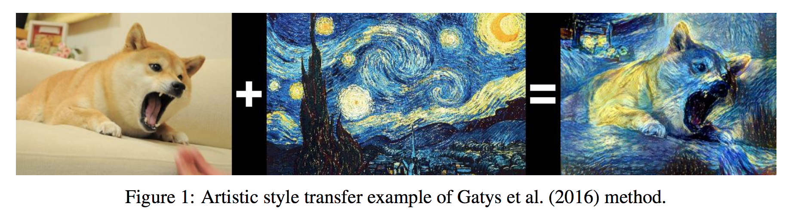

# Instance Normalization: The Missing Ingredient for Fast Stylization

# Info 

- Data : 11/ 2017 

- Authors : Dmitry Ulyanov, et al. 

- Journal reference : CVPR 2017  （この論文は[この](https://arxiv.org/abs/1701.02096) 再考版）

# どんなもの？

 Instance Normalization を提案．

stylization ネットワークのBatchNormalization を 提案手法（Instance Normalization） に置き換え，学習時も推論時も適用すると生成画像の質が良くなった．さらに，標準的なGPUで real time で style 変換することができる．

- style 変換の概要
  stylized image はstyle image と content image から得られた特徴量を合わせることで作られる．また両方の特徴量はpre-training のclassification モデルによって抽出される．style imageの特徴量(style statistics)は浅いネットワークから抽出され場所全体で平均かされる．content imageの特徴量(content statistics)は，深いネットワークから抽出され，位置情報を保存する．つまり，style statisticsはstyle imageの "texture" をとらえ，content statistics はcontent 画像の構造をとらえる．

  

# 先行研究と比べてどこがすごい？
## 先行研究の概要と問題点

先行研究 1 で初めてstyle 変換についての手法が提案された．しかし，提案された手法は計算的に非効率であり，１枚の画像（512x512）を変換するのに数分かかっていた（これは望ましいstatistics を得るまで繰り返し最適化を行うため）．先行研究 2, 3 はこの問題を対処する研究である．先行研究 2 は先行研究１と等価であるfeed-forward generator netoworksを学習することでこの問題に対処し，比較するに値する画像を出力することに成功した．しかし，２つとも先行研究１ほど，質の良い画像を生成できなかった．

# 技術や手法のキモはどこ？
（先行研究 2 の）generator のBatch NormalizationをInstance Normalizationに変更する．そしてInstance Normalizationを学習時だけでなく，推論時にも適用する．

この手法の操作による効果は，直感的にはnormalization プロセスが instance-specific contrast information をcontent image から取り除き，generator をシンプルにすること．

# どうやって有効だと検証した？

# 議論はある?

# 次に読むべき論文は?

## 先行研究

1. Gatys, L. A., Ecker, A. S., and Bethge, M. (2016). Image style transfer using convolutional neural
  networks. In The IEEE Conference on Computer Vision and Pattern Recognition (CVPR).
1. Johnson, J., Alahi, A., and Li, F. (2016). Perceptual losses for real-time style transfer and superresolution.
  CoRR, abs/1603.08155.
1. Ulyanov, D., Lebedev, V., Vedaldi, A., and Lempitsky, V. S. (2016). Texture networks: Feed-forward
  synthesis of textures and stylized images. In Proceedings of the 33nd International Conference
  on Machine Learning, ICML 2016, New York City, NY, USA, June 19-24, 2016, pages 1349–1357.