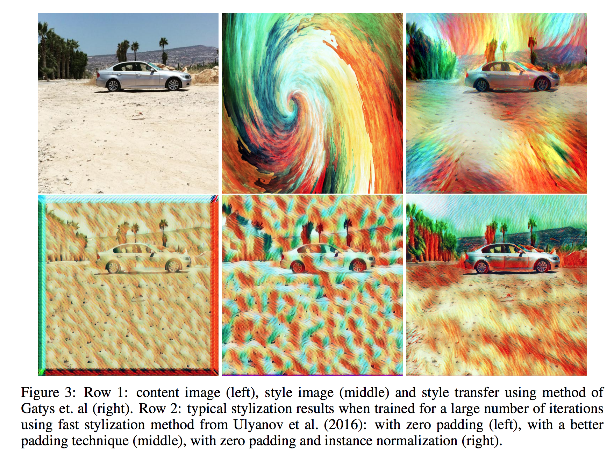

# Instance Normalization: The Missing Ingredient for Fast Stylization

# Info 

- Data : 11/ 2017 

- Authors : Dmitry Ulyanov, et al. 

- Journal reference : CVPR 2017  （この論文は[この](https://arxiv.org/abs/1701.02096) 再考版）

# どんなもの？

 Instance Normalization を提案．

stylization ネットワークのBatchNormalization を 提案手法（Instance Normalization） に置き換え，学習時も推論時も適用すると生成画像の質が良くなった．さらに，標準的なGPUで real time で style 変換することができる．

- style 変換の概要
  stylized image はstyle image と content image から得られた特徴量を合わせることで作られる．また両方の特徴量はpre-training のclassification モデルによって抽出される．style imageの特徴量(style statistics)は浅いネットワークから抽出され場所全体で平均化される．content imageの特徴量(content statistics)は，深いネットワークから抽出され，位置情報を保存する．つまり，style statisticsはstyle imageの "texture" をとらえ，content statistics はcontent 画像の構造をとらえる．

  

  具体的なロスの定義をいかに示す．
  ここではstyle image $\boldsymbol{x}_{0}$ を固定し， generator $g$ は 入力画像(content image) $\boldsymbol{x_t} (t=1, 2, \cdots, n))$ にstyle を適用する畳み込みネットワークとする．また， $\boldsymbol{z}_t \sim \mathcal{N}(0, 1))$ は i.i.d. のランダムノイズとする．すると $g$ は以下の最適化問題を解くように学習する．
  $$
  \min_g \frac{1}{N} \sum_{t=1}^n \mathcal{L}\big(\boldsymbol{x}_0, \boldsymbol{x}_t, g(\boldsymbol{x}_t, \boldsymbol{z}_t)\big)
  $$
  ここで，$\mathcal{L} $はpre-training のCNNを style image $\boldsymbol{x}_{0}$, content image $\boldsymbol{x_t}$, stylized image $g(\boldsymbol{x}_t, \boldsymbol{x}_t, \boldsymbol{z}_t)$ から特徴量を抽出するために使い，上記のようにその特徴量を比較する関数である（詳細は先行研究1 ?）．

# 先行研究と比べてどこがすごい？

## 先行研究の概要と問題点

先行研究 1 で初めてstyle 変換についての手法が提案された．しかし，提案された手法は計算的に非効率であり，１枚の画像（512x512）を変換するのに数分かかっていた（これは望ましいstatistics を得るまで繰り返し最適化を行うため）．先行研究 2, 3 はこの問題を対処する研究である．先行研究 3 は先行研究１と等価であるfeed-forward generator netoworksを学習することでこの問題に対処し，比較するに値する画像を出力することに成功した．しかし，２つとも先行研究１ほど，質の良い画像を生成できなかった．

先行研究 3の generator は早かったが，大規模な画像データで$g $ を最適化しようとすると，良くない質の画像ができることがわかっている（例: 16枚の画像で訓練した方が1000枚の画像の場合より良かった）．最も深刻なartifact は 画像の端に現れる．これは毎回の畳み込み操作の前に加えられるzero padding が原因である．

より複雑な padding 操作を利用しても改善されず，先行研究３で最も良かった結果を出したのは少数の画像で訓練し，早期終了をした場合であった．先行研究３では，「目的関数が複雑であり，標準的な畳み込みネットワークが学習することができない」と推測している．

# 技術や手法のキモはどこ？
（先行研究 2 の）generator のBatch NormalizationをInstance Normalizationに変更する．そしてInstance Normalizationを学習時だけでなく，推論時にも適用する．

style loss はstylized image のコントラストが style image のコントラストに似るように content image を変換する．よって，style 変換のトレーニングを安定させるためには generator が content image のコントラスト情報を無視するようにすれば良い．

この手法の操作による効果は，直感的にはnormalization プロセスが instance-specific contrast information をcontent image から取り除き，generator をシンプルにすること．

## 方法の詳細

コントラストを正規化するシンプルな方法は以下のような操作である．
$$
y_{t, i, j, k} = \frac{x_{t, i, j,k}}{\sum_{l=1}^W \sum_{m=1}^H} \tag{1}
$$
ただし， $x \in \mathbb{R}^{T\times C \times  W \times H}$ が$T$ 枚の画像バッチの入力テンソルとし，$i, j, k$ はそれぞれチャンネルの添え字，位置の添え字を表しているとする．

ここで Batch Normalization の操作を考える．BatchNorm と式(１) との違いはBatchNorm は単一画像ではなく，画像のバッチ全体に正規化を行う点である．

$$
y_{t, i, j, k} = \frac{x_{t, i, j,k} - \mu_i}{\sqrt{\sigma^2_i + \epsilon}}, \quad
\mu_i = \frac{1}{HWT}\sum_{t=1}^T \sum_{l=1}^W \sum_{m=1}^H x_{t, i, l, m}, \quad
\sigma^2_i = \frac{1}{HWT}\sum_{t=1}^T \sum_{l=1}^W \sum_{m=1}^H (x_{t, i, l, m}- \mu_i)^2,\tag{1}
$$

そこで，この研究では Bathc Normalization を単一のデータに適用する手法，Instance Normalization  を以下のように定式化する．

$$
y_{t, i, j, k} = \frac{x_{t, i, j,k} - \mu_{t,i}}{\sqrt{\sigma^2_{t, i} + \epsilon}}, \quad
\mu_{t,i} = \frac{1}{HW}\sum_{l=1}^W \sum_{m=1}^H x_{t, i, l, m}, \quad
\sigma^2_{t, i} = \frac{1}{HW} \sum_{l=1}^W \sum_{m=1}^H (x_{t, i, l, m}- \mu_i)^2,\tag{1}
$$

さらに BatchNorm とは違い，Instance Normalization はテストの時も学習時と同様に適用する．

# どうやって有効だと検証した？

Instance Normalizationが異なる構造のネットワークに有効であるかどうかを見るために，先行研究２，３で提案された両方の generator $g$ のBatch Normalization を全て Instance Normalization に変更した．

２つの異なるアーキテクチャに同じハイパーパラメーターを適用し，Instance Normalizationの効果を測定したところ，どちらも生成画像が格段に改善された．両方の generator の元々の quality は似ていたが，先行研究２で提案された residuals architecture の方が多少，より効果的であった．

# 議論はある?

# 次に読むべき論文は?

## 先行研究

1. Gatys, L. A., Ecker, A. S., and Bethge, M. (2016). Image style transfer using convolutional neural
  networks. In The IEEE Conference on Computer Vision and Pattern Recognition (CVPR).
1. Johnson, J., Alahi, A., and Li, F. (2016). Perceptual losses for real-time style transfer and superresolution.
  CoRR, abs/1603.08155.
1. Ulyanov, D., Lebedev, V., Vedaldi, A., and Lempitsky, V. S. (2016). Texture networks: Feed-forward
  synthesis of textures and stylized images. In Proceedings of the 33nd International Conference
  on Machine Learning, ICML 2016, New York City, NY, USA, June 19-24, 2016, pages 1349–1357.

